# SYSTEM V1.2 -- End-to-End Sequence Diagram

## Authority
This document does not grant authority. It is a descriptive reference for the SYSTEM V1.2 invocation-only agent architecture.

---

## Purpose

This document provides a comprehensive Mermaid sequence diagram illustrating the complete flow of the SYSTEM V1.2 invocation-only, human-orchestrated agent architecture. It demonstrates:

1. How human invocations initiate all activity
2. The Orchestrator's role as dispatcher (not executor)
3. Agent onboarding via orientation files
4. Artifact boundary enforcement between agents
5. Authority verification before execution
6. The complete lifecycle from request to completion

---

## Complete System Flow Diagram

```mermaid
sequenceDiagram
    autonumber

    %% Participants
    participant H as Human
    participant O as Orchestrator
    participant HI as Historian
    participant EN as Engineer
    participant NA as Notion Assistant
    participant FS as File System
    participant T as Tests

    %% ============================================
    %% SECTION 1: System Initialization
    %% ============================================

    rect rgb(240, 248, 255)
        Note over H,FS: PHASE 1: Session Initialization

        H->>O: Start session
        O->>FS: Read CLAUDE.md
        FS-->>O: Repository constraints
        O->>FS: Read system/v1.2/INDEX.md
        FS-->>O: System structure
        O->>FS: Read orientation/ORCHESTRATOR_ORIENTATION.md
        FS-->>O: Orchestrator constraints
        O-->>H: Ready for invocation
    end

    %% ============================================
    %% SECTION 2: Planning Flow (Historian)
    %% ============================================

    rect rgb(255, 250, 240)
        Note over H,FS: PHASE 2: Human Requests New Feature (Planning)

        H->>O: "Run the Historian to draft a plan for Feature X"

        Note over O: Orchestrator identifies work owner:<br/>Documentation/plans -> Historian

        O->>HI: Invoke with minimal prompt:<br/>"Task: Draft implementation plan for Feature X"<br/>"Project: projects/foo/"

        activate HI

        Note over HI: Agent Onboarding (Tiered Loading)

        HI->>FS: Read orientation/HISTORIAN_ORIENTATION.md
        FS-->>HI: Role constraints + template structures

        HI->>FS: Read projects/foo/AUTHORITY.md
        FS-->>HI: Authority index

        HI->>FS: Read authority/INVARIANTS.md
        FS-->>HI: Constraints to enforce

        HI->>FS: Read authority/DECISIONS.md
        FS-->>HI: Design decisions

        HI->>FS: Read templates/IMPLEMENTATION_PLAN_TEMPLATE.md
        FS-->>HI: Plan template structure

        Note over HI: Verify authority exists for requested work

        alt Authority Missing
            HI-->>O: HALT: Missing authority for Feature X
            O-->>H: Need decision recorded before planning
        else Authority Exists
            HI->>FS: Write plans/active/feature-x.md<br/>(Using template, citing authority)
            FS-->>HI: Plan created
            HI-->>O: Plan drafted: plans/active/feature-x.md
        end

        deactivate HI

        O-->>H: Historian created plan at plans/active/feature-x.md
    end

    %% ============================================
    %% SECTION 3: Execution Flow (Engineer)
    %% ============================================

    rect rgb(240, 255, 240)
        Note over H,T: PHASE 3: Human Authorizes Execution

        H->>O: "Run the Engineer to execute plans/active/feature-x.md"

        Note over O: Orchestrator identifies work owner:<br/>Code/tests/scripts -> Engineer<br/>Uses file-only directive

        O->>EN: Invoke with file-only directive:<br/>"Task: Execute active plan"<br/>"Ignore prior conversation output."<br/>"Use only: authority docs + active plan + code paths"<br/>"Project: projects/foo/"

        activate EN

        Note over EN: Agent Onboarding (Tiered Loading)

        EN->>FS: Read orientation/ENGINEER_ORIENTATION.md
        FS-->>EN: Role constraints + execution contract

        EN->>FS: Read projects/foo/AUTHORITY.md
        FS-->>EN: Authority index

        EN->>FS: Read plans/active/feature-x.md
        FS-->>EN: Active plan with ordered work

        EN->>FS: Read authority/INVARIANTS.md
        FS-->>EN: Constraints to enforce

        EN->>FS: Read authority/DECISIONS.md
        FS-->>EN: Design decisions to follow

        Note over EN: Authority Verification

        EN->>EN: Verify plan is in plans/active/
        EN->>EN: Verify plan declares "grants authority"
        EN->>EN: Verify plan cites INVARIANTS.md/DECISIONS.md
        EN->>EN: Verify cited sections exist

        alt Authority Verification Fails
            EN-->>O: HALT: Plan missing authority citation
            O-->>H: Plan needs authority before execution
        else Authority Verified
            Note over EN: Execute Plan Steps In Order

            loop For each step in Ordered Work
                EN->>FS: Read referenced code paths
                FS-->>EN: Source files
                EN->>FS: Write code changes
                FS-->>EN: Changes saved
                EN->>FS: Write test files
                FS-->>EN: Tests created
                EN->>T: Run tests

                alt Tests Fail
                    T-->>EN: FAIL
                    EN-->>O: HALT: Tests failing at step N
                    O-->>H: Execution halted - tests fail
                else Tests Pass
                    T-->>EN: PASS
                    EN->>FS: Update plan checkbox [x]
                    EN->>FS: Append to worklog
                end
            end

            EN->>FS: Complete Validation Checklist
            EN->>FS: Final worklog entry
            EN-->>O: Execution complete, all tests pass
        end

        deactivate EN

        O-->>H: Engineer completed plan execution
    end

    %% ============================================
    %% SECTION 4: Human Commitment Flow (Notion)
    %% ============================================

    rect rgb(255, 245, 250)
        Note over H,FS: PHASE 4: Human Commitment Tracking

        H->>O: "Run Notion Assistant with these Slack messages"<br/>[provides message links]

        Note over O: Orchestrator identifies work owner:<br/>Human commitments -> Notion Assistant

        O->>NA: Invoke:<br/>"Task: Propose Notion items from Slack signals"<br/>"Project: projects/foo/"

        activate NA

        Note over NA: Agent Onboarding

        NA->>FS: Read orientation/NOTION_ASSISTANT_ORIENTATION.md
        FS-->>NA: Role constraints + commitment contract

        NA->>FS: Read authority/INVARIANTS.md
        FS-->>NA: Commitment boundaries

        Note over NA: Process Input Signals

        NA->>NA: Parse Slack messages
        NA->>NA: Apply decision tree:<br/>Requires human decision/approval/response?

        alt Not Human Commitment
            NA-->>O: Item is implementation work,<br/>belongs in plan (Historian)
        else Is Human Commitment
            NA-->>O: Proposed Notion items:<br/>[Copy/paste ready format]<br/>Status: Next/Waiting/Blocked
        end

        deactivate NA

        O-->>H: Notion Assistant proposals ready for review

        Note over H: Human reviews and approves/rejects

        H->>H: Copy approved items to Notion
    end

    %% ============================================
    %% SECTION 5: Artifact Boundary Enforcement
    %% ============================================

    rect rgb(255, 240, 240)
        Note over H,FS: PHASE 5: Artifact Boundary Example

        H->>O: "Historian analyze this, then Engineer implement"

        O->>HI: Invoke: "Task: Analyze architecture for Feature Y"

        activate HI
        HI->>FS: Read required files
        FS-->>HI: Context

        Note over HI: Historian provides analysis

        alt Chat-Only Output (WRONG)
            HI-->>O: "Here's my analysis..." (in chat only)
            Note over O,EN: VIOLATION: Chat output is NOT<br/>a valid handoff artifact
        else File Output (CORRECT)
            HI->>FS: Write docs/feature-y-analysis.md
            FS-->>HI: Analysis saved
            HI-->>O: Analysis written to docs/feature-y-analysis.md
        end

        deactivate HI

        O->>EN: Invoke with file-only directive:<br/>"Ignore prior conversation output"

        activate EN

        EN->>FS: Read orientation file
        EN->>FS: Read authority docs
        EN->>FS: Read docs/feature-y-analysis.md
        Note over EN: Engineer uses ONLY file artifacts,<br/>ignores any chat summaries

        deactivate EN
    end

    %% ============================================
    %% SECTION 6: Halt Conditions
    %% ============================================

    rect rgb(255, 255, 240)
        Note over H,T: PHASE 6: Halt Condition Examples

        Note over O: Orchestrator Halt Conditions
        H->>O: Ambiguous request
        O-->>H: HALT: Unclear which agent handles this

        Note over HI: Historian Halt Conditions
        H->>O: "Create plan without authority"
        O->>HI: Invoke
        activate HI
        HI->>FS: Check for authority
        FS-->>HI: No matching authority found
        HI-->>O: HALT: No authority for requested scope
        deactivate HI
        O-->>H: Need to record decision first

        Note over EN: Engineer Halt Conditions
        H->>O: "Execute plan"
        O->>EN: Invoke
        activate EN
        EN->>T: Run tests
        T-->>EN: FAIL
        EN-->>O: HALT: Tests failing, cannot proceed
        deactivate EN
        O-->>H: Tests must pass before continuing
    end
```

---

## Diagram Key

### Participants

| Participant | Role | Key Constraint |
|-------------|------|----------------|
| Human | Authority owner | Only source of invocation |
| Orchestrator | Dispatcher | Never writes files directly |
| Historian | Documentation maintainer | Outputs must land in files |
| Engineer | Code executor | Reads from files only |
| Notion Assistant | Commitment proposer | Never creates without approval |
| File System | Artifact storage | Source of truth |
| Tests | Validation | Hard gate for execution |

### Phase Summary

| Phase | Description | Key Principle |
|-------|-------------|---------------|
| 1 | Session Initialization | Orchestrator reads constraints |
| 2 | Planning Flow | Historian drafts plans using templates |
| 3 | Execution Flow | Engineer executes with authority verification |
| 4 | Commitment Tracking | Notion Assistant proposes only |
| 5 | Artifact Boundary | Chat is not a valid handoff |
| 6 | Halt Conditions | Ambiguity/failure = stop and ask |

### Color Coding

| Color | Meaning |
|-------|---------|
| Blue (240, 248, 255) | Initialization |
| Orange (255, 250, 240) | Planning/Historian |
| Green (240, 255, 240) | Execution/Engineer |
| Pink (255, 245, 250) | Commitments/Notion |
| Red (255, 240, 240) | Boundary enforcement |
| Yellow (255, 255, 240) | Halt conditions |

---

## Non-Negotiable Patterns Illustrated

### 1. Invocation-Only
- Every action starts with explicit human invocation
- No background activity, polling, or self-starting

### 2. Authority is Document-Bound
- Engineer verifies plan citations before execution
- Historian checks authority exists before drafting plans
- Missing authority = HALT

### 3. Orchestrator as Pure Dispatcher
- Reads files for context only
- Never writes, edits, or executes
- Invokes agents with minimal prompts

### 4. Artifact Boundary Enforcement
- Historian outputs MUST land in files
- Engineer reads ONLY from files
- Chat output is non-existent for other agents

### 5. Tests as Hard Gates
- Failed tests = HALT
- No execution proceeds without passing validation

### 6. Tiered Loading
- Tier 1: Orientation file (always)
- Tier 2: Full specs/templates (on demand)
- Tier 3: Project context (for project work)

---

## Related Documents

- `system/v1.2/INDEX.md` -- System index
- `system/v1.2/CHANGELOG.md` -- Version history
- `system/v1.2/orientation/*.md` -- Role-specific orientation
- `system/v1.2/agents/*.md` -- Full agent specifications
- `system/v1.2/templates/AGENT_INVOCATION_PROTOCOL.md` -- Invocation protocol

---

## Version

- **Created**: 2026-01-02
- **System Version**: V1.2.1
- **Author**: Obsidian Project Historian
